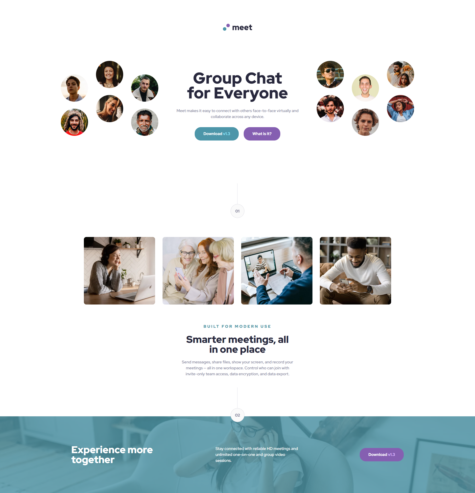

# pablodev - Meet landing page solution

This is a solution to the [Meet landing page challenge on Frontend Mentor](https://www.frontendmentor.io/challenges/meet-landing-page-rbTDS6OUR). Frontend Mentor challenges help you improve your coding skills by building realistic projects. 


## Overview

### The challenge

Users should be able to:

- View the optimal layout depending on their device's screen size
- See hover states for interactive elements

### Screenshot




### Links

- Solution URL: [Repositore URL]()
- Live Site URL: [Live server URL]()

## My process

### Built with

- Semantic HTML5 markup
- Flexbox


### What I learned

In this challenge I can learn a lot about how to deal with the "background image" where I can change the image.


```css
footer {
    background: linear-gradient(rgba(77, 150, 168, 0.8), rgba(77, 150, 168, 0.8)), url('/assets/desktop/image-footer.jpg');
    background-size: cover;
    display: flex;
    justify-content: space-between;
    align-items: center;
    width: 100%;
    padding: 5vw 15vw;
    height: 310px;
}
```

### Continued development


In continued study, I find myself obliged to continue practicing responsive CSS that actually works on any device, regardless of size!


## Author

- Website - [pablodev portfolio](https://www.pabloteixeira.site/)
- Frontend Mentor - [@yourusername](https://www.frontendmentor.io/profile/Pabloodev)

